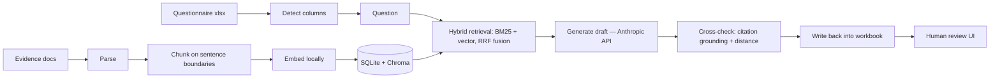

**What it does:** turns a vendor security questionnaire spreadsheet into a first-pass
draft, citing your own security docs for every answer, and never inventing a control
you don't have.
**Who it's for:** B2B companies that get handed CAIQ/VSAQ-style questionnaires by
prospective enterprise customers and need a fast, honest first draft before a human
reviews it.
**What it costs you today:** a few cents of Claude API spend per question row, a CLI
and (optionally) a local Streamlit review screen — no hosting, no account, no
subscription. Measured 63% structural match on a 24-question set (20 real CAIQ
questions plus an adversarial subset built to stress the no-fabrication goal). See
Results below for the real numbers.

<video controls width="700" poster="docs/demo.webm">
  <source src="docs/demo.webm" type="video/webm">
  (Your browser does not support HTML5 video — open <a href="docs/demo.webm">docs/demo.webm</a>.)
</video>

# Vendor Security Questionnaire Responder


Companies that sell to other businesses regularly get handed a long spreadsheet of
security questions by a prospective customer — "do you encrypt data at rest," "how
often do you review who has access to what," "can you delete our data on request" —
and someone has to answer every row correctly before the deal can close. This tool
reads a company's own security documentation (policies, procedures, plans) and drafts
first-pass answers to that spreadsheet automatically, citing exactly where each answer
came from. A person still reviews every answer before it goes out. The tool's job is
to make the first draft fast and honest, not to remove the human from the loop.

This is a CLI pipeline with an optional read-only review screen (`streamlit run
src/review_ui.py` — see Usage). The design rationale — why the tool never fabricates,
what is deliberately not built yet, and the v2 priority order — lives in
[`docs/DESIGN.md`](docs/DESIGN.md).



### Results at a glance

Measured against 24 security-questionnaire questions with known-correct answers —
20 real CAIQ v4.0.2 questions plus an adversarial subset of 4 written to stress the
no-fabrication guarantee (full breakdown and methodology in [`EVAL.md`](EVAL.md),
every tuning pass in [`TUNING_LOG.md`](fixtures/eval/TUNING_LOG.md)):

| Outcome | Count |
|---|---|
| ✅ Structural match (status + polarity vs. expected label) | **15 / 24 (63%)** |
| ⚠️ Confirmed textual fabrication (asserted a control the evidence does not document) | **0 / 24** |
| 🚫 Wrong for another reason (honest abstention, polarity mismatch, status-mapping defect) | 9 / 24 |

The adversarial subset is where the numbers get honest. It was written to catch
fabrications — questions whose answers are plausibly *implied* by the evidence but
not documented. The first published pass reported two fabrications (`ADV-02`,
`ADV-04`); re-reading the real captured answers against the evidence corrected
that: `ADV-02`'s cited sentence ("Backups are stored in a separate cloud region
from the primary production environment.") is verbatim in the evidence and directly
states the claim — the label was wrong, not the model (relabeled `ANSWERED_AFFIRMS`
on the evidence, see [`TUNING_LOG.md`](fixtures/eval/TUNING_LOG.md) pass 7), and
`ADV-04`'s answer text abstains correctly ("the IGA claim cannot be confirmed")
while the structured output reported `supported=true` — a status-mapping defect,
not an over-assertion. The stress test's real yield: it forced a labeler error into
the open, which is exactly the discipline the harness exists to enforce. The
usable/needs-editing/wrong hand-scores published earlier (13/20 usable on the
original 20) measure a different thing on a different set and await a blind re-score
per the scoring protocol in [`LABELING_GUIDE.md`](fixtures/eval/LABELING_GUIDE.md).

## The core design goal: never assert a control the evidence does not document

This is a design **goal with a measured failure rate**, not an unconditional
guarantee — see the adversarial results above and [`docs/DESIGN.md`](docs/DESIGN.md)
for the full reasoning, the enforcement layers, and the review requirements.

The goal: the tool will never assert a security control the organization has not
documented. The measured status: on the 24-question adversarial subset, **no
confirmed textual fabrication** (a claim beyond the cited evidence) has been found
on re-examination — the two cases first reported as fabrications turned out to be a
mislabel and a status-mapping defect, and the entailment layer (A1, behind a flag)
now guards the over-inference gap that grounding alone cannot. The two enforcement
layers documented in [`docs/DESIGN.md`](docs/DESIGN.md) are what they are: strong
against invented citations, and the honest limitation is that grounding alone is
weaker against over-inference from real citations — which is why the A1 entailment
check exists. Every output requires human review before it goes to a customer.

## Eval results

The headline number: **15/24 structural match** (status + polarity vs. expected
label) on the current 24-question set — the 20 original questions plus the
adversarial subset. (The previously published 14/24 counted `ADV-02` as a NOT_FOUND
regression; it was relabeled `ANSWERED_AFFIRMS` when the evidence was checked, and
now counts as a match.) The adversarial subset's yield on re-examination: **no
confirmed textual fabrication** — `ADV-02` was a mislabel, `ADV-04` is a
status-mapping defect whose answer text abstains correctly. See
[`TUNING_LOG.md`](fixtures/eval/TUNING_LOG.md) pass 7 for the full story. The
earlier 20-question hand-scores (65% usable, 0% fabricated) are a **superseded
hand-score on a different set**, awaiting a blind re-score per the scoring protocol
in [`LABELING_GUIDE.md`](fixtures/eval/LABELING_GUIDE.md) — they are not the
headline. The historical tuning passes — RRF fusion reweighting (12/0/8 → 13/0/7,
adopted) and the confidence threshold (rejected, because no value rescues the
failures without also breaking a question that must stay abstained) — are documented
in [`TUNING_LOG.md`](fixtures/eval/TUNING_LOG.md), alongside the retrieval-side
measurements of the P8/P10/P11/P12 changes.

Reproduce these numbers yourself with `python fixtures/eval/run_eval.py`. Full
methodology, the per-question failure taxonomy, the threshold-tuning data, three real
bugs the harness caught before it ever scored anything, and two diagnoses that were
overturned by instrumenting instead of inferring: see **[`EVAL.md`](EVAL.md)**.

## Setup

```
python3 -m venv .venv
source .venv/bin/activate
pip install -r requirements.lock   # pinned environment; requirements.txt is the loose declaration
pip install -e .          # optional: installs the `qresp` console command
```

The first `ingest` or `answer` run downloads a local sentence-transformers embedding
model (a few hundred MB). This can take a few minutes and looks like a hang — it isn't.
Enabling the optional cross-encoder reranker (`QRESP_RERANKER=true` or a config
file) downloads `BAAI/bge-reranker-base` (~1.1 GB) on first use — also local, also
one-time, and it runs on your machine with no API cost.

## Usage

Every command below can be run either as `python -m src.pipeline ...` (from the repo
root) or as `qresp ...` (after `pip install -e .`, from anywhere) — they are the
same CLI.

### 1. Ingest your evidence base

```
python -m src.pipeline ingest --evidence-dir path/to/your/evidence/
# or: qresp ingest --evidence-dir path/to/your/evidence/
```

Parses every `.md`, `.txt`, `.docx`, and `.pdf` file in the directory (PDF parsing
exists but is not yet validated against a real fixture — see Known limitations),
splits each into sections anchored to their original headings, embeds the sections
locally, and stores them in a local Chroma vector index plus a SQLite metadata store
(`out/chroma/`, `out/store.db`).

### 2. Answer a questionnaire

```
python -m src.pipeline answer \
  --questionnaire path/to/questionnaire.xlsx \
  --output out/filled.xlsx \
  --limit 5
# or: qresp answer --questionnaire path/to/questionnaire.xlsx --output out/filled.xlsx --limit 5
```

Detects the question/answer/constrained-vocabulary columns, answers each question
against the ingested evidence, and writes a filled copy of the workbook — merged
cells, section-header rows, blank spacer rows, and formatting are preserved; only
answer and vocabulary cells are touched.

Useful flags:
- `--limit N` — process at most N question rows (default 5). Use `--limit 0` to
  process every question in the sheet. Start small; a real questionnaire can be
  hundreds of rows and every row is a paid API call.
- `--only-row N` — process a single specific sheet row. Useful for targeted checks
  (e.g. re-running one flagged row, or exercising a specific abstention case).
- `--provider {anthropic,stub}` — see below.
- `--stub-fail-row N` — with `--provider stub`, forces that row to raise an error, to
  exercise the per-row failure-isolation path without spending real API calls.

Results are saved incrementally (every 5 rows, and always at the end) and every
processed row is appended to a sidecar `.jsonl` file next to the output workbook. A
crash partway through a run does not discard already-paid-for answers.

### Running without an API key: `--provider stub`

```
python -m src.pipeline answer --questionnaire fixtures/questionnaire_sample.xlsx \
  --output out/filled_stub.xlsx --limit 0 --provider stub
# or: qresp answer --questionnaire fixtures/questionnaire_sample.xlsx --output out/filled_stub.xlsx --limit 0 --provider stub
```

`--provider stub` exercises the entire pipeline — retrieval, column detection,
write-back, error isolation — without calling Claude or spending any money. It uses
the same retrieval-strength threshold the real path uses to decide whether it can
answer, so it's a meaningful test of the plumbing, not just a happy-path mock. Stub
output is stamped in the audit log and gets a visible red banner row in the output
workbook so it can never be mistaken for a real run's output.

`--provider anthropic` (the default) requires `ANTHROPIC_API_KEY` to be set and never
silently falls back to the stub if the key is missing — it errors instead, since every
row would otherwise fail identically.

### Supplying `ANTHROPIC_API_KEY`

Don't let an agent or script set this for you inside a session where it will end up in
scrollback or a generated file. Export it yourself:

```
export ANTHROPIC_API_KEY=sk-ant-...
```

or put it in a local `.env` file (already covered by `.gitignore` — never commit it)
and load it before running, e.g. `set -a; source .env; set +a`.

### 3. Review a completed run

```
streamlit run src/review_ui.py
```

Run this from anywhere — it works from a fresh clone with no extra setup (`pip
install -r requirements.txt` already covers it). This is a read-and-review surface
over the SQLite tables an `answer` run already wrote; it makes no Anthropic API calls
and doesn't re-run retrieval or generation. Pick a run in the sidebar, and for each
question you get the drafted answer side by side with the verbatim cited evidence
(source file + heading path), a confidence badge, and Approve / Edit / Reject buttons.
Approve/Reject record the decision; Edit saves your corrected text separately from the
model's original answer, so the eval-harness baselines in [`EVAL.md`](EVAL.md) stay
reproducible against what the model actually produced.

## What leaves your machine

This tool's stated buyer is a B2B security team, and the first question that buyer
asks is "where do my internal policies go." The answer, plainly:

**Runs entirely locally:** document parsing, chunking, embedding, retrieval (BM25 +
local vector index), the confidence cross-check, the workbook write-back, and the
review UI. None of those touch the network; the embedding model is downloaded once
and then runs on your machine.

**Sent to the Anthropic API — only during `answer`:** for each question row, the
system prompt, the question text, and the retrieved evidence passages (chunks of
your internal policies). Nothing else: no full documents, no workbook contents
beyond the question and the passages retrieval selected. `ingest`, `--dry-run`,
and the review UI make no API calls at all.

**Written to disk:** `out/store.db` (SQLite) holds your chunked policy text and
every drafted answer; `out/chroma/` holds the vector index of your policy text;
the sidecar `.jsonl` and `.log.jsonl` next to the output workbook hold drafted
answers and per-row detail. All of it is plaintext. The API key never touches disk
beyond an optional local `.env` file. [`.gitignore`](.gitignore) protects
`out/`, `.env`, and `.venv/` — nothing containing your policies or answers is
committed.

**Retention:** what Anthropic does with the prompts you send is governed by
Anthropic's current data-retention and privacy terms, which change over time —
read them directly rather than trusting a paraphrase here:
<https://docs.anthropic.com/en/docs/legal/data-usage>. Design for the assumption
that the question + retrieved passages leave your perimeter during `answer`.

**Review UI bind address:** `streamlit run src/review_ui.py` serves a database of
internal security policies — bind it to localhost explicitly:

```
streamlit run src/review_ui.py --server.address=127.0.0.1
```

## Design details

What is deliberately not built yet and why, plus the v2 priority order (what the eval
baseline actually showed blocking the score): see
[`docs/DESIGN.md`](docs/DESIGN.md).

## Tests

```
pytest tests/
```

`tests/test_pipeline_smoke.py` runs ingest, questionnaire parsing, and retrieval
against the real fixtures and asserts the pipeline reaches (and correctly stops at)
the Claude API boundary — it requires no API key and no network access beyond the
one-time embedding model download.

`tests/test_answerer_contract.py` asserts both `Answerer` implementations
(`AnthropicAnswerer`, `StubAnswerer`) return the same result shape, and that
`AnthropicAnswerer` raises rather than degrading when no API key is set.

`tests/test_whitespace_normalization.py` and `tests/test_malformed_response.py` are
regression tests for two of the three bugs the eval harness caught (see
[`EVAL.md`](EVAL.md)) — both built from the actual failing data the bug produced, not
a hypothetical case.

`tests/test_review_ui_entrypoint.py` executes `src/review_ui.py` under Streamlit's
actual `sys.path` setup (not just a curl against the running server, which never
triggers real script execution and would not have caught this) — regression test for
`streamlit run src/review_ui.py` failing with `ModuleNotFoundError` on a fresh clone.

## Fixtures

Everything under `fixtures/` is synthetic test data, invented for this repository —
not any real organization's policies or questionnaire. See the notice at the top of
each fixture file.

`fixtures/eval/` holds the eval harness: `questions.json` (the 20 labeled questions
behind the results above), `LABELING_GUIDE.md` (labeling methodology and the
anti-mirror sourcing rules), `TUNING_LOG.md` (every tuning pass, including the ones
that found no safe change to make), `questionnaire_eval.xlsx` (the same 20 questions
as an actual questionnaire workbook, generated from `questions.json` by
`make_eval_xlsx.py` — lets the eval set run through the real CLI, and doubles as a
20-row demo questionnaire instead of the 6-row sample), and `run_eval.py` (the
reproducible command behind the results in [`EVAL.md`](EVAL.md)). The eval questions
are quoted verbatim from the real CSA CAIQ v4.0.2 instrument, permitted by the
instrument's own license clause (quote portions with attribution to the Cloud
Security Alliance Cloud Controls Matrix Version 4.0.2; see the licensing section in
`LABELING_GUIDE.md`, which quotes the clause verbatim) — not an asserted fair-use
defense.
